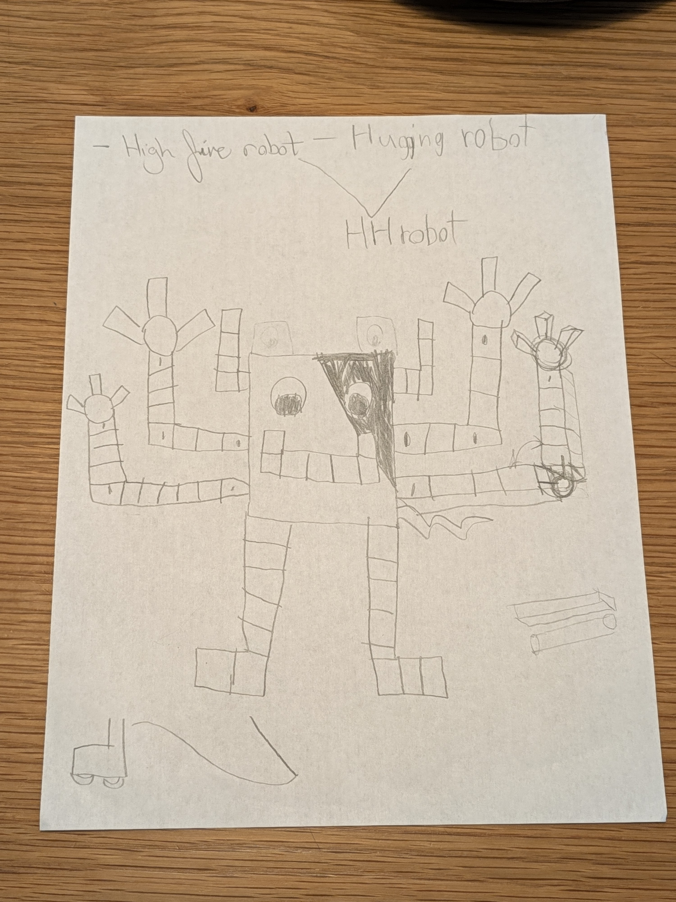

# Night Hands — the HH-Robot

**HH-robot** = **H**igh-**f**ive robot + **H**ugging robot.
Designed by **Jonathan (7)** and **Adam**. Built on Sunday mornings.

> Why: impress Mark Rober · have fun · show the class · make people happy



## What we are building, in order

| Phase | Thing | Looks like | Sundays |
|---|---|---|---|
| 0 | One servo twitches on the desk | a wire and a motor | 1 |
| 1 | **The Hand** — 3 tendon fingers | a hand on a stand that can high-five you | 4 |
| 2 | **The Arm** — shoulder + elbow + wrist | a whole arm that waves and high-fives | 4 |
| 3 | **Mini HH-robot** — ~14" tall, two arms, a head | Jonathan's drawing, standing up | later |

We build **one arm first**, exactly like the plan on paper says.

## The rule for this project

> Jonathan has a real job in every single step.

Not "hold this" — a real job. Design decisions, numbers he changes,
knots he ties, code he runs, poses he records. See
[`docs/jonathan.md`](docs/jonathan.md) for the job list.

## Start here

- [`docs/plan.md`](docs/plan.md) — the Sunday-by-Sunday build plan
- [`docs/bom.md`](docs/bom.md) — everything to buy, and where
- [`docs/decisions.md`](docs/decisions.md) — why we picked these parts (the engineering)
- [`docs/jonathan.md`](docs/jonathan.md) — Jonathan's job in each step
- [`docs/safety.md`](docs/safety.md) — the short safety list

## Repo layout

```
cad/        OpenSCAD source for the printed parts (parametric — numbers Jonathan can change)
firmware/   XIAO ESP32-S3 code that drives the servos
gestures/   Named poses: high-five, wave, fist, count-to-3
docs/       Plan, parts list, decisions
```
